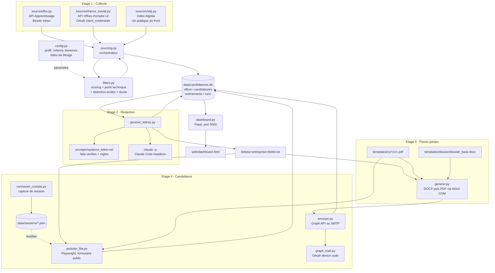

# Architecture - dashboard_alternance

## Vue d'ensemble

Le systeme est un pipeline en quatre etages, tous adosses a une base SQLite
unique qui sert de source de verite. Chaque etage est un script autonome :
aucun n'appelle directement un autre, ils communiquent par la base.

## Responsabilite de chaque module

| Module | Role | Ne fait pas |
|---|---|---|
| `config.py` | Profil d'exemple, baremes, listes de filtrage, seuils, valeurs par defaut | Aucune logique |
| `chemins.py` | Chemin des pieces d'une candidature, indexe par offre | Aucun acces base |
| `db.py` | Schema SQL, connexion, insertion idempotente, journal | Aucun appel reseau |
| `filters.py` | Scoring, pourcentage d'adequation, porte technique, detection d'ecoles, presence d'un canal | Aucun acces base |
| `sources/*.py` | Interrogation d'une API, normalisation vers le schema commun | Aucun scoring, aucune ecriture |
| `sourcing.py` | Orchestration collecte, enrichissement, insertion, rescore | Aucune redaction |
| `generer_lettres.py` | Appel de Claude Code headless, relecture par les skills, nettoyage typographique | Aucun envoi |
| `.claude/skills/` | Trois skills de redaction invoques a chaque lettre | Aucun effet hors redaction |
| `generer.py` | Composition DOCX, conversion PDF via Word COM | Aucune redaction |
| `postuler_lba.py` | Formulaire public LBA, sans compte | Aucune redaction |
| `postuler_wttj.py` | Formulaire interne WTTJ, session requise | Aucune redaction |
| `reconnaissance.py` | Releve ce que chaque formulaire accepte avant toute redaction | Ne remplit rien, n'envoie rien |
| `connecter_compte.py` | Capture d'une session de connexion | Ne lit aucun mot de passe |
| `parametres.py` | Surcouche `data/parametres.json` posee sur `config` | Aucune logique metier |
| `texte.py` | Normalisation partagee (minuscules, accents) | Rien d'autre |
| `journal.py` | data/logs/app.log, et traduction des echecs en messages utilisables | Aucune logique metier |
| `taches.py` | Execution des traitements longs en arriere-plan, suivi en base | Aucun traitement metier |
| `dashboard.py` | API HTTP : lecture, mutation de statut, declenchement de taches | Aucun traitement metier |
| `web/` | Interface : `index.html`, `style.css`, `app.js` | Aucun appel direct a la base |

## Interface

Trois fichiers statiques servis par Flask, sans chaine de build.

Le choix de rester en JavaScript sans framework est delibere : l'ecran se
resume a une navigation, une liste et un panneau de detail. React imposerait un
bundler, un `node_modules` et une etape de compilation pour un outil local
mono-utilisateur, sans rien apporter ici.

La separation en trois fichiers remplace le HTML unique precedent, devenu
illisible une fois le style, le gabarit et la logique melanges.

## Taches de fond

Une collecte dure environ 3 minutes, une generation de lettres 20 secondes par
offre, un depot de candidature 15 a 18 secondes. Ces durees depassent tout
delai de requete HTTP raisonnable.

`taches.py` lance donc le script concerne dans un sous-processus, suit sa sortie
ligne par ligne et ecrit la progression dans la table `taches`. L'interface
interroge `/api/tache` toutes les 1,2 seconde.

Trois decisions a connaitre :

- **Un thread, pas de broker.** Celery ou RQ ajouteraient un service a maintenir
  pour aucun benefice sur un outil local.
- **L'etat vit en base, pas en memoire.** Un redemarrage du serveur pendant une
  tache ne fait pas perdre sa trace ; les taches restees `en_cours` sont
  marquees interrompues au demarrage suivant.
- **Une seule tache a la fois.** Deux collectes simultanees se marcheraient sur
  les pieds en base, et deux navigateurs Playwright en parallele declenchent les
  protections anti-bot.

## Points de couplage a connaitre

Le schema de sortie des `sources/*.py` est un contrat implicite : tout
connecteur doit produire les memes cles que celles attendues par
`db.upsert_offre`. Ajouter une source revient a ecrire une fonction
`collecte()` renvoyant une liste de dictionnaires a ce format.

`filters.doute()` depend des raisons produites par `detecte_ecole()` et
`est_mission_technique()`. Modifier le format de ces chaines casse la
classification en file de validation sans lever d'erreur.

`generer_lettres.py` depend du binaire `claude` present dans le PATH et de
`CLAUDE_CODE_OAUTH_TOKEN`. Sans token valide, echec a l'authentification.

`generer.py` depend de Word installe (COM). Sans Word, la conversion PDF
echoue et il faut un autre convertisseur.
