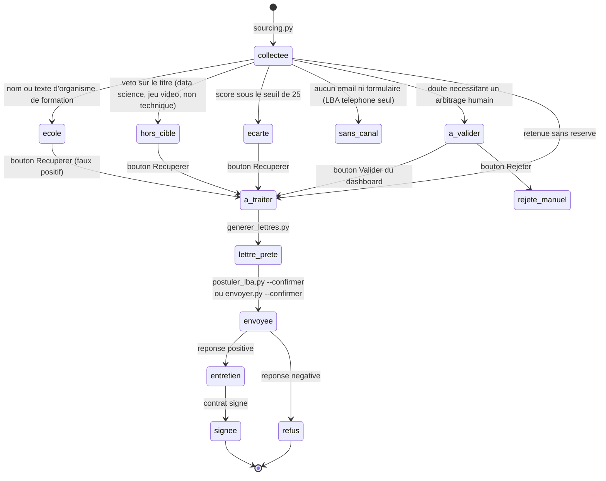
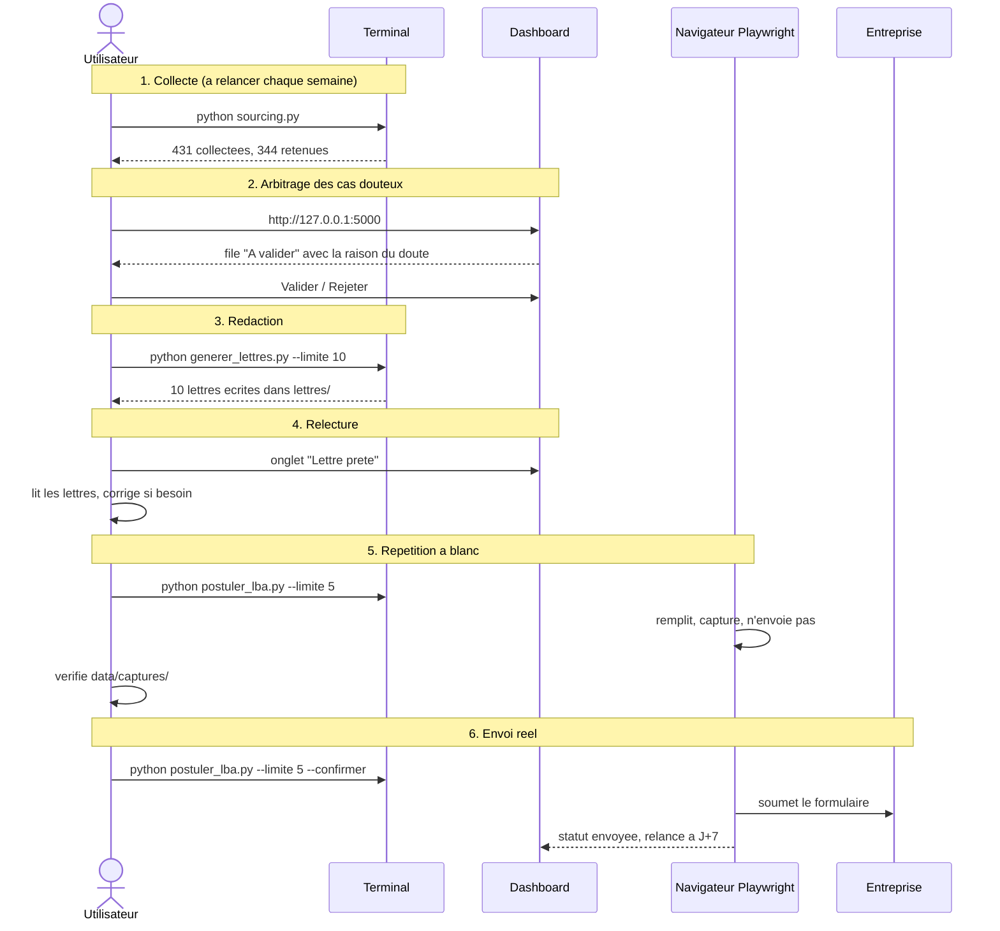

# Parcours utilisateur

## Cycle de vie d'une offre



Les statuts poses par une decision humaine (`db.STATUTS_FIGES`) ne sont jamais
ecrases par `sourcing.py --rescore`. Un arbitrage rendu est definitif.

## Parcours type, dans l'ordre



## Connexion a un site carriere

Necessaire une seule fois par site, et uniquement pour les sites qui exigent
un compte (WTTJ, Apec, JobTeaser). Le formulaire LBA n'en demande
pas.

```mermaid
sequenceDiagram
    actor R as Utilisateur
    participant S as connecter_compte.py
    participant N as Chromium Playwright
    participant F as data/sessions/&lt;site&gt;.json

    R->>S: python connecter_compte.py wttj
    S->>N: ouvre une fenetre visible sur la page de connexion
    R->>N: se connecte par email et mot de passe
    S->>S: detecte la disparition du champ mot de passe
    S->>F: storage_state (cookies + localStorage)
    S->>N: ferme la fenetre
    Note over F: reutilise par les scripts de candidature<br/>aucun mot de passe n'est lu ni stocke
```

Le script ne lit jamais les identifiants : il ne recupere que l'etat de session
produit par le navigateur apres une connexion faite a la main.
