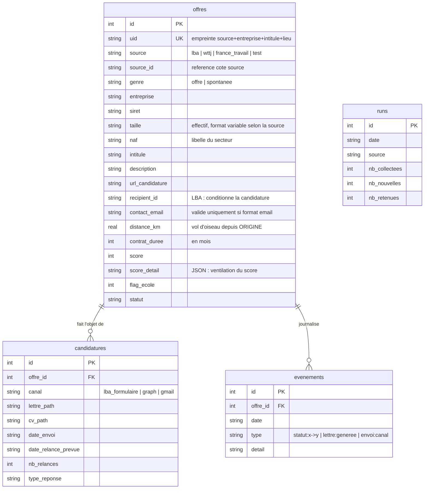

# Reference technique

## API HTTP du dashboard

Serveur Flask local, `http://127.0.0.1:5000`. Aucune authentification : il
n'ecoute que sur la boucle locale et ne doit jamais etre expose.

### GET /

Rend `web/dashboard.html`. Injecte les statistiques, les sources presentes,
les libelles de pipeline et de rejet, le profil et l'adresse de reference.

### GET /api/offres

| Parametre | Type | Defaut | Role |
|---|---|---|---|
| `statut` | string | `a_valider` | Filtre sur `offres.statut` |
| `genre` | string | vide | `offre` ou `spontanee` |
| `source` | string | vide | `lba`, `wttj`, `france_travail` |
| `limite` | int | 300 | Nombre maximum de lignes |

Reponse : tableau JSON d'offres, triees par score decroissant. Chaque element
reprend les colonnes de la table plus trois champs calcules : `detail`
(`score_detail` deserialise), `doute` (raison de l'arbitrage), `mots_cles`
(huit premiers mots-cles reconnus), `extrait` (400 premiers caracteres de la
description).

```json
[{"id": 59, "score": 113, "entreprise": "COGIS NETWORKS",
  "statut": "a_traiter", "doute": null,
  "mots_cles": ["python", "api rest", "sql"],
  "detail": {"mots_cles": 88, "proximite": 20, "prime_dev": 30,
             "grand_groupe": null, "mission_technique": "technique:9_signaux"}}]
```

### POST /api/offre/&lt;id&gt;/statut

Corps JSON : `{"statut": "...", "note": "..."}`. `note` est optionnelle.

Statuts acceptes : ceux de `db.STATUTS`, plus `valide_manuel` et
`rejete_manuel`. `valide_manuel` est traduit en `a_traiter` a l'ecriture, mais
l'intention est tracee dans `evenements` pour qu'un rescore ne la remette pas
en doute.

| Code | Cas |
|---|---|
| 200 | `{"ok": true, "statut": "<statut effectif>"}` |
| 400 | Statut inconnu |
| 404 | Offre introuvable |

### GET /api/stats

Retourne `{"stats": {...}, "evenements": [...], "maj": "JJ/MM/AAAA HH:MM"}`.
`evenements` contient les vingt dernieres entrees du journal, jointes a
l'entreprise et a l'intitule.

## Schema de donnees



`offres.uid` porte une contrainte d'unicite : `upsert_offre` utilise
`INSERT OR IGNORE`, la collecte est donc idempotente. Relancer `sourcing.py`
n'insere que les nouveautes.

`score_detail` est un JSON libre. Les cles actuelles : `mots_cles`,
`mots_cles_trouves`, `negatifs`, `negatifs_trouves`, `proximite`, `duree`,
`contrat`, `secteur_naf`, `prime_dev`, `bonus_taille`, `grand_groupe`,
`prime_groupe`, `mission_technique`, `doute`, `total`.

## Conventions du projet

**Secrets.** Tout passe par `.env`, jamais en dur. `.gitignore` exclut `.env`,
`data/` (base, sessions, captures), `token*.json`. La cle Algolia de WTTJ fait
exception : elle est publique, embarquee dans le bundle JS du site, et n'ouvre
qu'une recherche en lecture.

**Ecriture en base.** Seuls `sourcing.py`, `generer_lettres.py`,
`postuler_lba.py`, `envoyer.py` et `dashboard.py` ecrivent. Les modules
`sources/*` et `filters.py` sont purs.

**Irreversibilite.** Tout script pouvant atteindre un tiers exige
`--confirmer`. Sans ce drapeau, le comportement par defaut est une repetition
a blanc avec capture d'ecran. Cette regle n'a aucune exception.

**Typographie.** Aucun tiret cadratin ni demi-tiret dans les lettres
generees : `generer_lettres.nettoyer()` les remplace, et le prompt systeme les
interdit. Motif : ces caracteres sont devenus un marqueur de texte genere.

**Cadence reseau.** LBA est limite a 60 appels par minute, d'ou une pause de
1,1 s. WTTJ et les formulaires utilisent 1,2 s et 8 s respectivement. Ces
valeurs ne sont pas cosmetiques : elles evitent le blocage.

## Points de securite ouverts

`data/sessions/*.json` contient des cookies de session qui donnent acces aux
comptes concernes. Le repertoire est exclu du git mais les fichiers ne sont pas
chiffres au repos. Une compromission du poste les expose.

Le dashboard n'authentifie pas ses appels et accepte toute mutation de statut.
Acceptable tant qu'il n'ecoute que sur `127.0.0.1` : ne jamais le passer en
`host='0.0.0.0'`.

Les requetes SQL utilisent partout des parametres lies, sauf dans
`outils/reset_test.py` ou la clause `IN` est construite par interpolation du
nombre de marqueurs, pas des valeurs. Aucune donnee utilisateur n'y transite.

Le projet n'est pas sous git. La separation prod/test attendue par le
CLAUDE.md global n'est donc pas en place : il n'y a qu'une base,
`data/candidatures.db`. Les offres de test sont isolees par `source='test'` et
une adresse de contact neutralisee, ce qui est un garde-fou faible.
